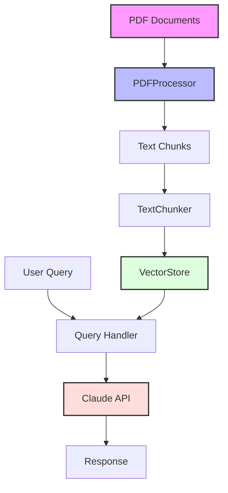

# RAG Implementation with Python and Anthropic

This project implements a Retrieval-Augmented Generation (RAG) system using Python, integrating Anthropic's Claude API for language model capabilities along with various other technologies for document processing and vector search.

## Features

- Document processing and text extraction from PDFs
- Text chunking for optimal context handling
- Vector storage and semantic search using ChromaDB
- Integration with Anthropic's Claude API for enhanced responses
- Support for metadata and URL preservation
- Efficient handling of large documents through intelligent chunking

## Architecture

The system follows a modular architecture with the following main components:



## Prerequisites

- Python 3.8+
- Required packages:
  - anthropic
  - pypdf
  - chromadb
  - langchain
  - unstructured

## Installation

1. Clone the repository:
```bash
git clone <repository-url>
cd rag-project
```

2. Install dependencies:
```bash
pip install -r requirements.txt
```

3. Set up your Anthropic API key:
```python
import os
os.environ["ANTHROPIC_API_KEY"] = "your-api-key"
```

## Usage

1. Place your PDF documents in the designated directory
2. Run the notebook sections sequentially
3. Use the `ask_question()` function to query your documents:

```python
question = "What is the main topic of the documents?"
answer = ask_question(question)
parsed_content = parse_textblock(answer[0])
print(parsed_content['answer'])
print(parsed_content['sources'])
```

## Key Components

### PDFProcessor
Handles document ingestion and text extraction while preserving metadata and URLs.

### TextChunker
Implements intelligent text splitting for optimal context handling.

### VectorStore
Manages document embeddings and semantic search functionality using ChromaDB.

### ClaudeQuerier
Integrates with Anthropic's Claude API for enhanced response generation.

## Performance

The system demonstrates efficient processing capabilities:
- Quick document processing and chunking
- Fast vector search retrieval
- Response generation typically within 5-6 seconds

## Limitations

- Requires an active Anthropic API key
- PDF processing may vary depending on document formatting
- Vector store needs to be rebuilt if new documents are added

## Contributing

Feel free to open issues or submit pull requests with improvements.

## License

[Your chosen license]

## Acknowledgments

- Anthropic for the Claude API
- ChromaDB team for the vector store implementation
- LangChain community for various utilities
